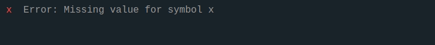

# CalcSpace

[calcspace.com](https://calcspace.com) is a web application that lets you build multi-line calculations and instantly see the results. It supports units of measurement, so it's great for physics and engineering. Sharing mechanism makes it easy to collaborate with other people.



## Repository structure

This repository contains both backend and frontend code.
Backend code sits in the `/server` directory and frontend code in the `/client` directory.

## Technologies

Here is a list of a few of the most important technologies used on this project:

- JavaScript (technically TypeScript but with a very forgiving configuration)
- ReactJS
- ExpressJS
- PostgreSQL + [node-postgres](https://www.npmjs.com/package/pg)

## Development

### NodeJS version

NodeJS version that is currently used in the project can be found in the `.nvmrc` file. It should match the version specified in `server/package.json > engines.node` (for Heroku) and in both Dockerfiles.

### Install dependencies

```
yarn run install:all
```

### docker-compose cheat sheet

Start app by running:

```
docker-compose up -d
```

Stop app:

```
docker-compose down
```

Rebuild docker images:

```
docker-compose up -d --build --force-recreate --remove-orphans
```

See logs:

```
docker-compose logs -f
```

### DB migrations

Database migrations are run on every start of the NodeJS server. They are specified in the `setupDatabase.ts` file.

### Deployment

On every push to the `master` branch, application deploy is triggered automatically.
Backend is deployed on Heroku and frontend is deployed on Netlify.

### Math parser

Calcspace uses a custom math parser. For more details check [parseExpression docs](./client/src/shared/math/expressionParser/docs/docs.md) and parsing analyzer tool on [calcspace.com/analyze](https://calcspace.com/analyze).
